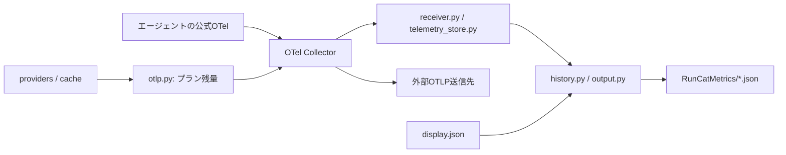

# アーキテクチャと開発

Python 3.9以降の標準ライブラリと、公式OTel Collectorを使います。
毎分の残量取得プロセスと、Collector・RunCat変換アダプターの常駐プロセスがあります。

## 処理の流れ



`collect`はJSONを書かず、残量のGaugeをOTLP/HTTP JSONで送信します。
Collectorはネイティブのprotobuf/JSONを受信し、RunCatアダプターへJSONで転送します。
アダプターはSQLiteへ受信状態と増分を保存し、受信時・毎分に表示を更新します。
プラン履歴とネイティブトークン実績は別の系列として保持します。

## ソース構成

| パス | 責務 |
| --- | --- |
| `src/app.py` | CLI解析と1回分の更新処理 |
| `src/agent_setup.py` | エージェントのOTel設定・バックアップ・設定確認・CLI起動 |
| `src/diagnostics.py` | 自動更新の状態診断と復旧手順の案内 |
| `src/config.py` | 表示設定の検証・永続化 |
| `src/providers/` | サービス別の認証・取得・レスポンス解析 |
| `src/cache.py` | API結果のキャッシュ |
| `src/otlp.py` | 残量のOTLPメトリクス定義とHTTP送信 |
| `src/telemetry_store.py` | 受信値、増分集計、重複排除の永続化 |
| `src/receiver.py` | OTLP/HTTP JSON受信、RunCat表示生成 |
| `otel/` | Collector設定・エージェント設定例 |
| `src/history.py` | SQLite履歴と期間集計 |
| `src/output.py` | 表示文字列とCustom Metrics JSONの生成 |
| `src/storage.py` | JSONの安全な読み書き |
| `scripts/` | インストール、アンインストール、リリース |
| `tests/` | 標準`unittest`による単体・統合テスト |

## ローカル検証

```sh
python3 scripts/version.py check
PYTHONPATH=src python3 -m unittest discover -s tests -v
sh -n scripts/install.sh
sh -n scripts/install-collector.sh
sh -n scripts/uninstall.sh
sh -n scripts/release.sh
brew style Formula/runcat-ai-usage.rb
```

公式Collectorを使った、2つの送信先への配信テストも実行できます。
エージェントの認証情報は使用せず、fixtureのメトリクスのみを送ります。

```sh
sh scripts/install-collector.sh /tmp/runcat-test-otelcol
PYTHONPATH=src RUNCAT_TEST_COLLECTOR=/tmp/runcat-test-otelcol python3 -m unittest discover -s tests -v
```

実際の認証状態を確認する場合だけ、次を実行します。

```sh
PYTHONPATH=src python3 -m runcat_ai_usage --doctor
```

テストでは実ユーザーの認証情報、LaunchAgent、履歴を変更しないでください。
Providerの変更では正常系に加え、欠損フィールド、不正な型、認証失敗をテストします。

## リリース

安定版は `vMAJOR.MINOR.PATCH` の注釈付きタグからGitHub Actionsが作成します。
バージョン更新、テスト、タグ作成には `scripts/release.sh` を使います。公開タグは
移動・再利用せず、修正は新しいパッチ版としてリリースします。

詳しい手順は[RELEASING.md](../RELEASING.md)を参照してください。
