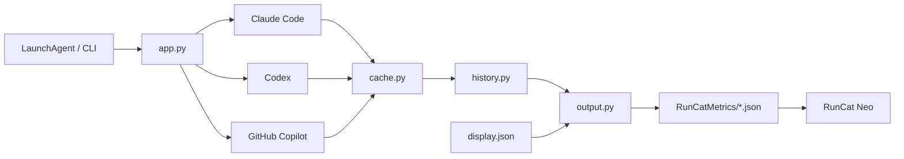

# アーキテクチャと開発

Python 3.9以降の標準ライブラリだけで動作する、小さな1回実行型のCLIです。
macOSのLaunchAgentが60秒ごとに起動します。

## 処理の流れ



1. `services.py` が3サービスと取得関数を定義します。
2. `providers/` が既存CLIの認証情報を使って利用量を取得・正規化します。
3. `cache.py` が再取得間隔と一時エラー時の前回値を管理します。
4. `history.py` が絶対使用量をSQLiteへ記録し、増加量を集計します。
5. `output.py` が表示設定を適用し、RunCat Neo形式のJSONを原子的に更新します。

## ソース構成

| パス | 責務 |
| --- | --- |
| `src/app.py` | CLI解析と1回分の更新処理 |
| `src/config.py` | 表示設定の検証・永続化 |
| `src/providers/` | サービス別の認証・取得・レスポンス解析 |
| `src/cache.py` | API結果のキャッシュ |
| `src/history.py` | SQLite履歴と期間集計 |
| `src/output.py` | 表示文字列とCustom Metrics JSONの生成 |
| `src/storage.py` | JSONの安全な読み書き |
| `scripts/` | インストール、アンインストール、リリース |
| `tests/` | 標準`unittest`による単体・統合テスト |

## ローカル検証

```sh
python3 scripts/version.py check
PYTHONPATH=src python3 -m unittest discover -s tests -v
sh -n scripts/install.sh
sh -n scripts/uninstall.sh
sh -n scripts/release.sh
brew style Formula/runcat-ai-usage.rb
```

実際の認証状態を確認する場合だけ、次を実行します。

```sh
PYTHONPATH=src python3 -m runcat_ai_usage --doctor
```

テストでは実ユーザーの認証情報、LaunchAgent、履歴を変更しないでください。
Providerの変更では正常系に加え、欠損フィールド、不正な型、認証失敗をテストします。

## リリース

安定版は `vMAJOR.MINOR.PATCH` の注釈付きタグからGitHub Actionsが作成します。
バージョン更新、テスト、タグ作成には `scripts/release.sh` を使います。公開タグは
移動・再利用せず、修正は新しいパッチ版としてリリースします。

詳しい手順は[RELEASING.md](../RELEASING.md)を参照してください。
