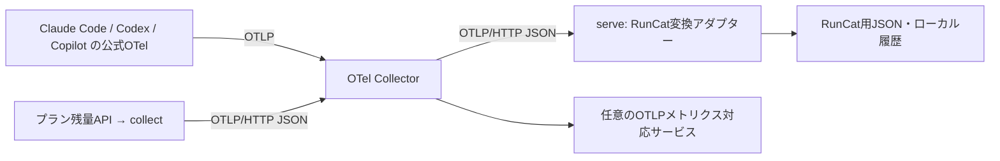

# OpenTelemetryによる収集・配信

## 構成



`collect`（引数なしでも同じ）はプラン残量を毎分取得してCollectorへ送信します。
JSONを直接書く経路はありません。`serve`がCollectorから受信し、従来のRate、
Today / 1h、推移を生成します。プラン残量APIは公式OTelで取得できない情報のため
引き続き使用します。各エージェントのトークン実績から契約残量を推定しません。

ローカルのCollectorは公式contribディストリビューション0.161.0です。
Python側は標準ライブラリでOTLP/HTTP JSONを扱います。各エージェントが送る
protobufはCollectorが受信・変換するため、独自のprotobuf実装はありません。

## インストールと既存環境からの移行

OTel対応はv0.5.0以降で利用できます。Homebrewでは `brew update` と
`brew upgrade runcat-ai-usage` で更新すると、自動的に新しい構成をセットアップします。
ソースから導入する場合はリポジトリのディレクトリで実行します。

```sh
./scripts/install.sh --no-open
```

初回は公式CollectorのmacOS用バイナリ（約100MB）をダウンロードし、リポジトリに
固定したSHA-256で検証します。配置先は `~/Library/Application Support/RunCat AI Usage/bin/`。
既に用意した互換Collectorを使う場合は、絶対パスを渡します。

```sh
RUNCAT_AI_USAGE_COLLECTOR=/absolute/path/to/otelcol-contrib ./scripts/install.sh --no-open
```

次のLaunchAgentを登録します。ログイン後も自動起動します。

| Label | 動作 |
| --- | --- |
| `dev.runcat.ai-usage` | 毎分の残量取得・OTLP送信 |
| `dev.runcat.ai-usage.collector` | Collectorの常駐 |
| `dev.runcat.ai-usage.receiver` | RunCat変換アダプターの常駐 |

既存のJSON登録、`display.json`、残量履歴・キャッシュを引き継ぎます。
出力先・stateのパスも既存LaunchAgentから引き継ぎ、環境変数で上書きできます。
初回の残量反映まで1〜2分待ってください。Collector停止中も既存のJSONは残ります。
再インストール時に既存 `otel/collector.yaml` は上書きしません。

## 各エージェントの公式OTel設定

インストーラーはCollector・RunCat変換・残量の定期取得を自動設定します。
エージェント側の設定は次のコマンドで適用します（v0.5.0以降）。
ソースから試す場合は `runcat-ai-usage` の代わりに
`PYTHONPATH=src python3 -m runcat_ai_usage` を使ってください。

```sh
runcat-ai-usage agents setup all --dry-run  # 変更対象だけ確認
runcat-ai-usage agents setup all            # 全対象に適用
runcat-ai-usage agents status               # 設定状態を確認
```

`all` の代わりに `claude`、`codex`、`copilot`、`vscode` を指定すると、その対象だけ設定します。
`all` は未インストールのエージェントにも設定を作成します。インストーラー自体は
エージェント設定を変更しないため、利用するものだけ個別に設定することもできます。

| 対象 | `agents setup` の変更先・起動方法 |
| --- | --- |
| `claude` | `~/.claude/settings.json` の `env` に追加。以後は通常の `claude` 起動で有効 |
| `codex` | `~/.codex/config.toml` の `otel.metrics_exporter` を設定。以後は通常の `codex` 起動で有効 |
| `copilot` | `~/.local/bin/runcat-copilot` を作成。このコマンドでCopilot CLIを起動すると有効 |
| `vscode` | `~/Library/Application Support/Code/User/settings.json` にCopilotのOTel設定を追加 |

変更するのはローカルCollectorへの送信に必要な設定です。既にメトリクス送信先を設定している
場合はローカルCollectorに切り替わるため、外部宛先は下記のCollector側に追加してください。
Claude・Copilot CLIではRunCatで使用しないログ・トレースのexporterを `none` に設定します。
Codexの既存ログ・トレース設定は維持します。

無関係な設定は保持し、VS Codeのコメントも残します。変更前のファイルは同じディレクトリの
`<元ファイル名>.runcat-backup-*` にアクセス権600で保存します。繰り返し実行しても
変更がなければ書き換えません。復元するには表示されたバックアップを元のパスへコピーし、
エージェントを再起動してください。Copilot CLIの設定を外すには生成した
`~/.local/bin/runcat-copilot` を削除します。通常の `copilot` コマンドには影響しません。

Claudeの `CLAUDE_CONFIG_DIR`、Codexの `CODEX_HOME` に対応します。
別のVS CodeプロファイルやInsidersなどには明示的に設定ファイルを指定します。

```sh
runcat-ai-usage agents setup vscode --config-path "$HOME/Library/Application Support/Code - Insiders/User/settings.json"
```

不正なJSONや安全に編集できないTOML形式（例: `otel = { ... }` のインラインテーブル）、
シンボリックリンクのファイルは上書きせずエラーにします。リンク先を編集する場合は
`--config-path` で実体を指定してください。`all` は一つの対象が失敗しても残りを処理し、
いずれか失敗した場合は終了コード1を返します。

設定を永続化せず、CLIを一回だけOTel付きで起動することもできます。

```sh
runcat-ai-usage agents run claude -- --help
runcat-ai-usage agents run codex
runcat-ai-usage agents run copilot
# setup copilot 後の通常の起動:
~/.local/bin/runcat-copilot
```

`agents run` は子プロセスの環境変数、Codexでは公式の `-c` オプションを使用します。
設定適用後はエージェントを再起動し、VS Codeはウィンドウを再読み込みしてください。
`agents status` はローカル設定の確認で、実際の送信やプロジェクト設定・管理ポリシーの
上書きまでは判定しません。実際にエージェントを使用した後に `--doctor` で配送を確認します。

手動設定用のテンプレートもソースとインストール先の `otel/agents/` にあります。
以下は手動で設定する場合の説明です。

### Claude Code

起動するシェルで以下を読み込みます。永続化する場合はClaude Code設定の`env`に
同じ値を追加してください。

```sh
source "$HOME/Library/Application Support/RunCat AI Usage/otel/agents/claude.sh"
claude
```

`CLAUDE_CODE_ENABLE_TELEMETRY=1`、`OTEL_METRICS_EXPORTER=otlp`を設定し、
HTTP/protobufで `http://127.0.0.1:4318/v1/metrics` に送ります。
標準のセッション識別属性を維持してください。

### Codex

`~/.codex/config.toml` の既存 `[otel]` テーブルへマージします。
`exporter`はログ用で、メトリクスには`metrics_exporter`を使います。

```toml
[otel]
metrics_exporter = { otlp-http = { endpoint = "http://127.0.0.1:4318/v1/metrics", protocol = "binary" } }
log_user_prompt = false
```

この設定と`turn.token_usage`に対応するCodexのバージョンが必要です。
古いバージョンでは更新してください。管理ポリシーでメトリクス送信が禁止されている
環境ではそのポリシーが優先されます。

### Copilot

VS Codeのsettings.jsonに `otel/agents/vscode.json` をマージします。
Copilot CLIは、`otel/agents/copilot.sh` を起動するシェルで読み込みます。
CLIの対応はバージョンによって異なります。Copilot SDKを利用する場合も公式の
TelemetryConfigで同じCollectorを指定できます。

Copilot側のエージェントメトリクスと、`gh`認証によるプラン残量取得は独立しています。
受信するメトリクス名は下表のとおりです。ログやトレースはRunCatでは使用せず、
同梱Collectorのパイプラインもmetricsのみです。

## RunCat表示と集計

```sh
runcat-ai-usage config set --rows rate,remaining,tokens,cost,change,trend
```

初期設定は `rate,change,trend,tokens,cost`。保存済みの行設定はそのまま維持します。
`remaining`はメイン利用率に対する残りの割合です。Claudeの5時間・7日枠はRateに
個別表示し、OTLPにはそれぞれの残量も送信します。
`tokens` / `cost` は対象のデータを一度受信してから表示します。

| 入力メトリクス | RunCatの集計 |
| --- | --- |
| `claude_code.token.usage` | 入力・出力・キャッシュのトークン数 |
| `claude_code.cost.usage` | 推定費用（USD）。契約料金や残量とは別 |
| `turn.token_usage` / `codex.turn.token_usage` | `token_type=input,output`のHistogramのsum |
| `gen_ai.client.token.usage` | `service.name=copilot-chat,github-copilot`かつ`gen_ai.token.type=input,output`のHistogramのsum |

Codexのtotal、cached_input、reasoning_outputは重複加算しません。
Cumulative Sum/Histogramは差分、Deltaは増分を永続化し、再送・再起動でも同じ
データ点を二重計上しません。同時セッションはリソース・属性・開始時刻で区別します。
先に新しいCumulative値を受け取った場合、遅れて届いた古い値は無視します。
トークン・費用の増分はデータ点の終了時刻に割り当てるため、最初のCumulative値や
長いエクスポート間隔にまたがる日付・時間の内訳は近似です。

OTelを有効にした端末・プロセスの実績だけを集計します。他端末や未対応クライアントの
利用量、過去の利用は復元できません。残量API側は契約全体の値を維持します。

任意の追加メトリクスはCollectorから外部へそのまま転送できます。RunCat変換は上記と
プランメトリクスを対象とし、それ以外は保存しません。

## 外部サービスへの配信

`~/Library/Application Support/RunCat AI Usage/otel/collector.yaml` のexportersに
宛先を追加し、`service.pipelines.metrics.exporters`にも登録します。
`otel/remote.example.yaml`は設定の差分例です。OTLP/HTTPの例:

```yaml
exporters:
  otlp_http/remote:
    endpoint: https://your-otel-service.example
    headers:
      Authorization: ${env:RUNCAT_REMOTE_OTLP_AUTHORIZATION}
    sending_queue:
      storage: file_storage
      queue_size: 1000
    retry_on_failure:
      max_elapsed_time: 0s
service:
  pipelines:
    metrics:
      exporters: [otlp_http/runcat, otlp_http/remote]
```

URLはサービス指定のOTLPベースURLを使用します。完全なメトリクスURLが指定される
サービスでは`metrics_endpoint`を使います。OTLP/gRPCや他のプロトコルはCollectorの
対応するexporterを設定してください。

launchdはシェルの環境変数を引き継ぎません。認証値は
`~/Library/LaunchAgents/dev.runcat.ai-usage.collector.plist` の
`EnvironmentVariables`へ設定し、アクセス権を適切に制限してください。
再セットアップ時もCollectorの追加環境変数は維持されます。
設定の検証と再読み込みは `runcat-ai-usage-install --no-open`、ソース版では
`./scripts/install.sh --no-open` で行えます。宛先ごとの永続キューはstate配下に保存します。
キューが満杯の場合やCollector停止中の送信は、データを失う場合があります。

初期状態はローカルのみです。外部送信を設定すると、利用量やエージェントの
リソース属性もその宛先へ送られます。必要に応じてCollectorのprocessorsで属性を
削除・変換してください。API認証トークンをOTLPに含める処理はありません。

## 診断と障害時の動作

`--doctor`は残量取得の定期実行、Collectorと受信アダプターの起動・HTTP応答、
直近のOTLP配送、各プラン値の鮮度を確認します。ネイティブOTelの最終サンプルは
参考情報として表示し、エージェントを使っていない時間を障害と判定しません。

残量APIが失敗すると前回値・取得時刻を保持し、RunCatに古い値であることを表示します。
ネイティブトークンが届いても、プラン残量の取得時刻は更新しません。
表示設定と時刻に依存する集計は受信時と毎分更新します。
ログは `monitor.error.log`、`collector.error.log`、`receiver.error.log` です。
外部サービス側の受付後の処理やRunCat画面そのものはdoctorの診断対象外です。

## 公式資料

- [Claude Code monitoring](https://code.claude.com/docs/en/monitoring-usage)
- [Codex configuration reference](https://developers.openai.com/codex/config-reference)
- [Copilot agent monitoring](https://code.visualstudio.com/docs/agents/guides/monitoring-agents)
- [Copilot SDK OpenTelemetry](https://docs.github.com/en/copilot/how-tos/copilot-sdk/observability/opentelemetry)
- [OTLP specification](https://opentelemetry.io/docs/specs/otlp/)
- [Collector OTLP HTTP exporter](https://github.com/open-telemetry/opentelemetry-collector/tree/main/exporter/otlphttpexporter)
